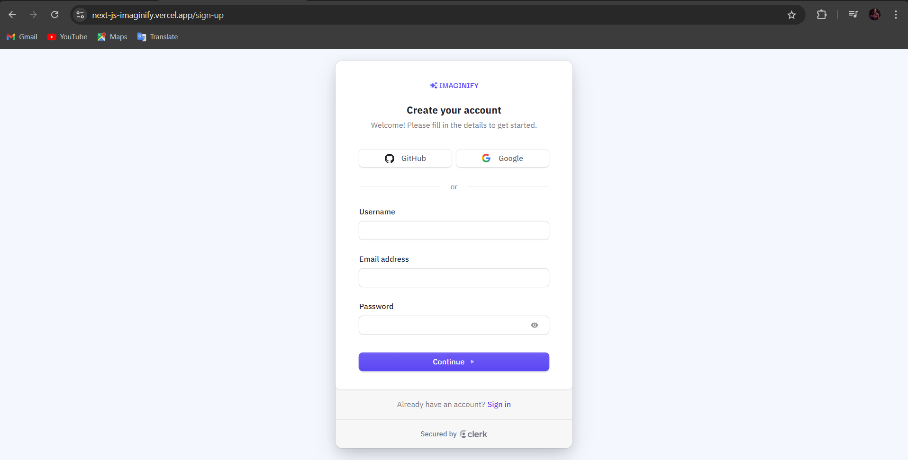

## Imaginify

Imaginify is a fully functional and responsive web application designed to enhance and transform images using Cloudinary AI. The application offers several advanced features to cater to various image editing needs, along with a comprehensive credit system for transactions.
## Live Demo

Check out the live demo [here](https://next-js-imaginify.vercel.app/).

### Features

1. **Image Restoration**: Enhance and restore old or damaged images to bring them back to life.
2. **Generative Fill**: Use AI-powered tools to fill in missing parts of an image creatively.
3. **Object Removal**: Easily remove unwanted objects from your images.
4. **Background Removal**: Quickly and accurately remove backgrounds from images.
5. **User Profile**: Users can view their remaining credits, track their usage, and manage their account settings.

### Credit System

Imaginify operates on a credit system where users can perform image transformations using credits. The system includes different tiers to suit various needs:

- **Free Tier**: Includes 10 free credits by default for new users.
- **Pro Plan**: Costs $40 and provides 120 credits.
- **Premium Plan**: Costs $199 and offers 2000 credits.

Credits are deducted based on the transformations performed, and additional credits can be purchased at any time through the app.

### Payment Integration

Payments for purchasing credits are securely processed using Stripe, ensuring a smooth and safe transaction experience for users.

### Authentication & Authorization

User authentication and login are managed with Clerk, providing a secure and seamless user experience. Users can sign up, log in, and manage their accounts with ease.

### Technology Stack

- **Frontend**: Built with React and Next.js for a responsive and interactive user interface.
- **Backend**: Utilizes Cloudinary AI for image processing and transformation.
- **Payments**: Integrated with Stripe for handling transactions and subscriptions.
- **Authentication**: Managed by Clerk for secure and efficient user management.

Imaginify is designed to provide a user-friendly experience, making advanced image editing accessible to everyone. Whether you are restoring old photos, removing backgrounds, or making creative edits, Imaginify has the tools you need.


## Live Images For Laptop





## Live Images For Mobile


## Live Images For Tablet


## Getting Started

Follow these steps to set up the project on your local machine:

1. **Fork the Repository:**
   - Click on the "Fork" button at the top right corner of this repository's GitHub page.

2. **Clone the Forked Repository:**
   To clone the repository, use the following command:
```bash
git clone https://github.com/VrajVyas11/Next-JS_Imaginify.git
```

You can copy this command and paste it into your terminal to clone the project repository.

3. **Navigate to the Project Directory:**
     cd Next-JS_Imaginify

4.**Install Dependencies:
       Ensure you have Node.js and npm installed, then run: **

         npm install

5. **Set Up Environment Variables:
Create a .env file in the root directory and add the necessary environment variables as specified in .FakeENV.**


6.**Start the Development Server:**
   npm start

7.**Open Your Browser:
Navigate to http://localhost:3000 to see the application running.**

